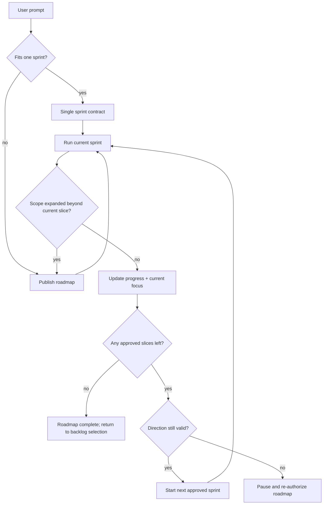

# Agents-Stack Multi-Sprint Visibility

## Problem Frame
When a user gives a broad request that cannot honestly fit in one sprint, the current harness can preserve the one-runnable-sprint rule while still silently creating a chain of follow-on sprints. The user then loses sight of the remaining work, cannot easily tell whether the agent is still aligned with the original request, and has no clear stopping point for the autopilot decomposition. Late discovery is the worst case: the first sprint starts on a too-small slice, and only later does the system realize more work remains.

## User Flow

## Requirements

**Initiative-level control**
- R1. When a request is expected to require more than one sprint, the system must publish a non-runnable initiative roadmap before starting the first sprint. If a running sprint later discovers the request is broader than the current slice, execution must pause and the roadmap must be published or revised before any follow-on sprint is created.
- R2. The roadmap must name the source goal, the current slice, the ordered remaining slices or phases, and the condition that ends the roadmap. The roadmap is the canonical initiative-level sequence; `features.json` remains the runnable selector and does not need to pre-create every future slice.
- R3. If the remaining slice count is uncertain, the roadmap must label it as provisional instead of inventing precision.

**Visible progress**
- R4. Every sprint update must show completed slices, remaining slices, and the next owner or next action.
- R5. The live resume anchor must link each sprint back to the source goal and current roadmap phase so a cold-start agent can verify direction quickly.

**Guardrails**
- R6. Any addition, deletion, split, or reorder of roadmap slices is a roadmap revision and must be surfaced and approved before another sprint is auto-created.
- R7. The harness must not auto-create an unbounded chain of follow-on sprints; continuation beyond the published roadmap requires explicit re-authorization or roadmap revision.
- R8. The one-runnable-sprint rule remains unchanged; the roadmap is non-runnable and exists only to govern allowed future slices.

## Success Criteria
- A user can answer from files alone: what goal is being pursued, how many slices remain, what is currently active, and whether the next sprint still matches the original prompt.
- Direction drift is explicit rather than discoverable only after a later sprint finishes.
- Auto-created sprint chains stop at a visible boundary instead of continuing indefinitely.
- A late discovery of extra work pauses the chain instead of silently spawning another sprint.

## Scope Boundaries
- Do not redesign execution, review, or retry mechanics.
- Do not allow multiple runnable sprints.
- Do not hide the roadmap inside chat memory or transient output.
- Do not invent exact implementation files or APIs here.

## Key Decisions
- Use a first-class non-runnable roadmap for broad requests; this is the strongest default.
- Give roadmap publication and revision to a dedicated non-runnable roadmap-planning phase, not to execution or review.
- Keep `features.json` as the runnable selector, `current-focus.md` as the resume anchor, and `progress.md` as the outcome ledger.
- Treat `docs/live/roadmap.md` as the canonical initiative-level artifact for source goal, planned slices, goal changes, and resume rules.
- Treat roadmap edits as control-plane events, not casual notes.

## Alternatives Considered
- Overlay current live files only: quickest to ship, but remaining work stays provisional and harder to trust.
- Expansion budget / forced re-authorization: strongest stop-the-line safeguard, but more interruptive.
- First-class roadmap gate: best balance of visibility, boundedness, and integrity.

## Dependencies / Assumptions
- This assumes the repo is willing to add `docs/live/roadmap.md` or an equivalent durable initiative-level artifact.
- This assumes state-update can publish roadmap changes alongside sprint outcomes.
- This assumes broad requests can be classified as single-sprint or multi-sprint before the first sprint starts, and that late discovery can force a roadmap revision before another sprint begins.

## Outstanding Questions
### Deferred to Planning
- Should `features.json` carry a pointer to the active roadmap phase, or should `docs/live/roadmap.md` stand alone?
- What exact event should force re-authorization: any new slice, only a material change in direction, or only a count increase beyond the original roadmap?
- How should the roadmap phase be named and integrated with the existing worker model?

## Next Steps
→ /ce:plan for structured implementation planning if the roadmap gate is accepted